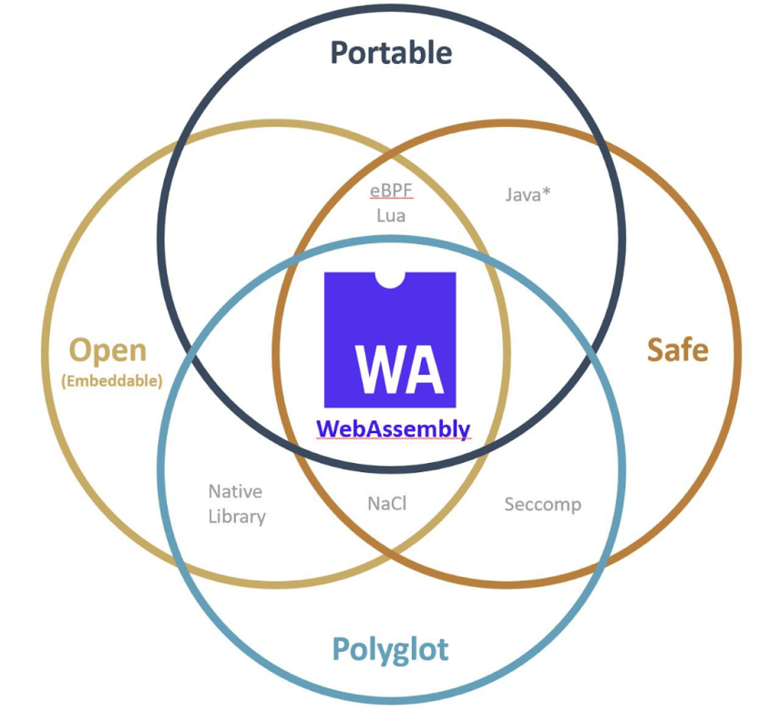

# Cloud Native :cloud: Wasm Day :spider_web: (4th May 2021) - Part I

## Table of Contents

1. [Opening Remarks](##opening-remarks)
2. [WASI: A new kind of system interface and what it means for Cloud Native](##wasi-a-new-kind-of-system-interface-and-what-it-means-for-cloud-native)
3. [From napkin to the Cloud: A WebAssembly journey](##from-napkin-to-the-cloud-a-webassembly-journey)
4. [AI inference on the Edge Cloud using WebAssembly](##ai-inference-on-the-edge-cloud-using-webassembly)
5. [Wasm in the Wild West: A Practical Application Tale](##wasm-in-the-wild-west-a-practical-application-tale)
6. [What can WebAssembly do for your Application Security and Extensibility](##what-can-webassembly-do-for-your-application-security-and-extensibility)
7. [WebAssembly as a cloud-native runtime for serverless functions](##webassembly-as-a-cloud-native-runtime-for-serverless-functions)

## Opening Remarks

### Speakers

1. <u>Chris Aniszczyk</u> is the CTO of [Cloud Native Computing Foundation](https://www.cncf.io/) (CNCF). CNCF is a project by the Linux Foundation for the advancement of container technology. 
2. <u>Colin Eberhardt</u> is the Technology Director of [Scott Logic](https://www.scottlogic.com/). Scott Logic is a software consultancy in the UK.

### History of Wasm

1. **1995**: JavaScript becomes the thrid language of the web alongside HTML and CSS.
2. **Problem**: How to enable bringing languages other than JS into the browser? Before WebAssembly, to use other langauges than JS on the web, plug-in models (e.g., Flash, Java applet, etc.) were used unsuccessfully.
3. **2013**: Mozilla :fox_face: launches [asm.js](https://en.wikipedia.org/wiki/Asm.js) (a subset of JS). It allowed users to run code written in a strictly-typed language (with memory management) like C. It then used a source-to-source compiler like [Emscripten](https://emscripten.org/) to compile C to asm.js.
4. **2017**: Wasm was developed on the basis of Mozilla's asm.js.
5. **2019**: W3C incorporates Wasm along with HTML, CSS, and JS as the fourth language of the web. First change to W3C in 25 years.

### WebAssembly, a misnomer

1. Wasm isn't an assembly language.
2. Wasm isn't just for the web. Wasm runtime is a lightweight, portable, and secure sandbox. This also appeals to non-browser applications e.g., [blockchain smart contract engine](https://blog.scottlogic.com/2019/11/26/webassembly-on-the-blockchain.html), IoT, cloud native services, etc.

### Relevance of Wasm to Cloud-native

1. Wasm has a great future both within and outside the browser. The Wasm runtime's lightweight and secure isolation model makes it an attractive candidate for <u>cloud native applications</u> like running cloud functions, running code on the edge, and running code within proxies.
2. CNCF has adopted Wasm technology in its [Envoy project](https://github.com/envoyproxy/envoy), an edge and service network proxy. They subsituted Lua to Wasm because Wasm was a much more lighter subsitute for the heavyweight Lua.
3. Microsoft has been developing [Krustlet](https://github.com/deislabs/krustlet), a Kubernetes engine that allows you to run Wasm workloads on a Kubernetes cluster.

## WASI: A new kind of system interface and what it means for Cloud Native

### Speaker

1. <u>Lin Clark</u> is a Senior Principal Engineer at [Fastly](https://www.fastly.com/), a cloud computing service provider. She previously worked at Mozilla, NPM, and Drupal. She is the co-founder of the [Bytecode Alliance](https://bytecodealliance.org/) that builds standards for Wasm and WASI and to build an ecosystem of WebAssembly beyond the browser.

### Why?

1. **Common problems** in Wasm and Cloud-native communities—
   * Dealing with code that depends on the <u>concept of a file system</u> in a place where there is no file system.
   * <u>Separating the business logic from the orchestration</u> of that app.

### Why was WASI created?

1. Enable <u>languages other than JS</u> to run on browsers at near-native speeds. 
2. Needs to run in a <u>well-isolated, secure sandbox</u> because you can't trust the internet.
3. To be fast, the language binary should be close to the user's native ISA (instruction set architecture e.g., x86, Arm64, RISC-V, etc.) but without specializing to any specific ISA. Wasm created a low-layered abstraction over these ISAs. This makes Wasm <u>portable</u>.
4. Portability motivated <u>out-of-browser applications</u>.
5. But these applications <u>compromised security and portability</u> by giving Wasm full access to OS syscall library. This is unsafe and ties you to the OS. We need both an abstract ISA and an abstract OS.
6. **WASI**: a modular set of system interfaces. It includes the usual low-level system interfaces but also some high-level ones (e.g., neural networks, crypto, etc.).

### Challenge: Concept of file systems

1. Today, having <u>direct access to the file system</u> is the exception than the rule. Examples— apps on the browser, cloud, edge, FAIRified, etc.
2. Components of a file—
   * <u>Data</u>: an array or stream of data. 
   * <u>Metadata</u>: data about data e.g., filename, time stamps, permissions, storage device information, etc. These are specific to the OS of the host. Very few programs care about this.
3. <u>Compute</u>: working with data. <u>Metacompute</u>: working with metadata. Push metacompute to the edge as much as possible.
4. <u>Example</u>: a commandline app that shrinks an image file. 
   * <u>File system-centric paradigm</u>: the Wasm module runs from inside a secure sandbox in the host system. Input argument: filename. Wasm module uses the filename to make an open syscall and obtain a file handle from the OS. Then the wasm module uses the handle to read a stream of bytes. Here, the wasm module needs to know about the native file system. 
   * <u>Pushing the metacompute to the edge</u>: the module runs `main(Stream) -> Result(Stream, Error)`. When run on command line the OS knows that the module needs a `Stream`. OS knows how to convert a file into a `Stream` (open the file handle). So, the host sends the `Stream` directly. Wasm doesn't need to know about the host OS. This design is more portable. It is also more secure (Wasm didn't need to make a syscall).

### Gradual adoption paths to use WASI with security and portability

1. <u>Legacy Wasm code</u>: already follows bad practices from traditional file system APIs. It makes assumptions about the host OS. Use the `legacy file system interface` compiler flag. This will link your code in terms of WASI's file system interface (like POSIX APIs). Doesn't use virtualized file system, so it isn't fully portable. The code won't run in places where the host doesn't provide direct access to the file system.
2. <u>Compatibility layer</u>: Users still use file APIs from their language library. The module implicitly virtualizes the file system and stores in linear memory. The file types are WASI IO types. Very portable but generates larger file size.
3. <u>Use WASI IO APIs directly</u>: Uses code using WASI IO APIs directly. Write functions using IO types like `Streams` and not in terms of the file system. This code is very portable.

### Opportunity for cloud-native

1. Making a request from one container in one pod to another container in another pod is highly inefficient.
2. It involves making 5 copies of data in each of the sender and the receiver pod. This is mainly because the service container is isolated from the sidecar container.
3. Substitute the communication with a synchronous function call. Prevents the need for intermediate serialization/deserialization.
4. Reduces the communication time to nanoseconds.

## From napkin to the Cloud: A WebAssembly journey

### Speaker

1. Kevin Hoffman is a Software Engineer at Capital One. He is also the creator of [wasmCloud](https://wasmcloud.com/), a Wasm host runtime for Cloud-to-Edge Actor model. He is the author of the book 'Programming WebAssembly with Rust'.

### wasmCloud

1. WebAssembly is the <u>future of distributed computing</u>. 
   * a binary
   * fast, small, and efficient 
   * stack-based VM
   * CPU/OS-agnostic
   * <u>Dependent on the host environment</u> (in-browser: JS; out-of-browser: wasmtime, wasmer, wasm3, wasmCloud).
2. <u>wasmCloud</u> is an actor runtime and platform for wasm actors. It provides a self-healing and self-forming lattice mesh connecting clouds, IoT, and the edge.

### From Napkin (concept design)

1. <u>wasmCloud Chat</u>: a multi-channel, real-time messaging application.

2. <u>Big idea</u>: Users log-in either through the Telnet channel or the broker channel. The chat services provided are: authorization & authentication, presence (who is online? how long have they been online?), chatrooms, and messages.

   

3. <u>Typical journey</u>: idea :bulb: --> initial design (napkin) --> early experimentation --> redesign architecture --> refactoring/redesign --> despair :sob: .

4. <u>Expectations from wasm</u>: idea :bulb: --> initial design (napkin) --> early experimentation --> test deploy across platforms --> tweak to handle volume/load --> joy :joy:. 

### To the Cloud (final product)

1. <u>Deploying chat services as microservices</u>: non-functional dependencies (code other than business logic) are the main causes of refactorization.
2. <u>Deploying chat services as wasm actors</u>:
   * Initial experimentation: design a monolith wasmCloud host i.e. all services in one host.
   * Subsequent experiments: split the monolith into multiple hosts or microservices.
   * Difference from microservices: splitting into microservices is a design choice and not an architectural requirement.
   * wasmCloud manages the function calls between the distributed actors.
3. Implementation: https://github.com/wasmCloud/examples/tree/main/wasmcloud-chat
   * Entire application is only 702 KB.
4. <u>Summary</u>: when compared to the microservices approach, the wasmCloud approach significantly reduced the distance between the napkin and the cloud.

## AI inference on the Edge Cloud using WebAssembly

### Speaker

1. Michael Yuan, founder of [Second State](https://www.secondstate.io/), a part of [Microsoft for Startups](https://startups.microsoft.com/en-us/) to develop the next generation of software infrastructure for cloud computing.

### Challenges with AI inference at the edge

1. [>95% of all real-world compute tasks in AI are inference and only 5% is training.](https://www.ibm.com/downloads/cas/QM4BYOPP).
2. More accurate neural network models have <u>longer run times</u>.
3. <u>Compute power is constrained</u> at the edge.

### Potential Solutions

1. **Python for inference**: Slow. Most edge devices don’t support Python. Limited support to web frameworks.
2. **Native apps on the edge**: They are fast but tied to native OS and architecture (not portable). Don’t support web frameworks. Vulnerable to attacks (not secure). Need OS-level access control (not safe).
3. **WebAssembly via Rust**: Wasm is fast, is a secure sandbox, is language-agnostic, and has strong community support. Rust is safe and both time- and memory-efficient. Most compute intensive task in AI inference is pre-/post-processing and Rust can help speed it up considerably.

### [SSVM (now called WasmEdge)](https://github.com/WasmEdge/WasmEdge)

1. An open-source Wasm VM for <u>performance-intensive server-side applications</u>.

### Wasm approaches to TensorFlow inference

1. **Scenario 1: Interpreted mode on a CPU**: [Read your pre-built TF model (`*.pb`) using TF operators written in Rust or C/C++ (`tract`)](https://github.com/sonos/tract). Compile it to Wasm. Execute in interpreter mode on CPU. 
   * Easy to run. 
   * <u>Latency</u>: Very slow. A single inference using MobileNetV2 takes <u>10+ minutes</u> to run on a modern Intel CPU.
   * <u>Example</u>: https://github.com/second-state/rust-wasm-ai-demo
2. **Scenario 2: Using JIT compilers**: Read your pre-built TF model using TF operators written in Rust or C/C++. Compile to Wasm. Execute in a JIT runtime (e.g. browser V8).
   * <u>Latency</u>: Single inference takes <u>2-3 seconds</u>. 
   * <u>Example</u>: [TF.js](https://github.com/tensorflow/tfjs/tree/master/tfjs-backend-wasm). Uses TF's C runtime to compile to Wasm. Loaded into a JS application. Run in the browser.
3. **Scenario 3: Compile TF model directly into Wasm**: Write the model and compile directly to Wasm (no intermediate  `*.pb`). So, at runtime TF ops don't have to be mapped into Wasm ops.
   * <u>Latency</u>: Single inference takes <u>1-2 seconds</u>.
   * Hard to perform pre-/post-processing around the Wasm module containing the model.
   * <u>Example</u>: [Apache TVM](https://github.com/apache/tvm) (TF/PyTorch/mxnet/ONNX -> Wasm) and [ONNC-Wasm](https://github.com/ONNC/onnc-wasm) (ONNX -> Wasm).
4. **Scenario 4: Using host functions via WASI**: Python calls native C/C++ libraries of TF. It doesn't interpret/compile at runtime. Similarly, call native TF library from Wasm.
   * <u>Latency</u>: Single inference takes <u>0.5 seconds</u>.
   * <u>Example</u>: [WASI-tensorflow](https://www.secondstate.io/articles/wasi-tensorflow/).
5. **Scenario 5: Use special hardware from host functions in WASI**: WASI can take advantage of special hardware (GPU, TPU), and AOT compilers. 
   * <u>Latency</u>: Inference now takes <u>0.05 seconds</u>.
   * <u>Example</u>: [SSVM on Tencent Serverless](https://github.com/second-state/tencent-tensorflow-scf).

## Wasm in the Wild West: A Practical Application Tale

### Speakers

1. Matt Butche (Principal Software Development Engineer) and Taylor Thomas (Senior Software Engineer) are Software Engineers at Azure, Microsoft. Matt has worked on Helm, Kubernetes, and Open Stack. Taylor has worked on Helm, Kubernetes, Krustlet, and Docker.

### Projects

1. [Krustlet](https://github.com/deislabs/krustlet): Run Wasm workloads (a straight binary instead og using a container) on a Kubernetes cluster.
2. [Bindle](https://github.com/deislabs/bindle): Aggregate Object Storage. A place to store all your Wasm things (like a silverware drawer).
3. [WAGI](https://github.com/deislabs/wagi): To write cloud-side Wasm apps over a HTTP network.

### Haven't we been here before?

1. **Java VM**: Highly configurable. Very bulky. Only supports Java language.
2. **Containers**: Lighter than Java. Runs many languages with extra steps. Not cross-platform (Linux and Windows containers aren't cross-compatible). Extra steps to build (Dockerfile).
3. **Wasm runtimes**: Very light (both runtime and the binary). Lighter than well made containers. Sandboxed with a capabilities model. Cross-platform. Compiled from any language.
   * <u>Types of Wasm runtimes</u>: 1) interpreted (wasm3), 2) JIT compiled (wasmtime, emscripten), and 3) AOT compiled (wasmtime). AOT compiled code exchanges platform independence for speed.
   * Tools to <u>optimize Wasm modules</u>: 1) [Wasm-opt](https://github.com/WebAssembly/binaryen), 2) preload module to cut-down time, 3) use JIT compilers, 4) use AOT compiler, and 5) use [wizer](https://github.com/bytecodealliance/wizer) pre-initializer for speeding up load time.

### JavaScript Vs. Rust

1. **JavaScript**: 1) good first language for Wasm, 2) flexible and popular, and 3) poor for systems-level development.
2. **Rust**: 1) New and not accessible, 2) most of the Wasm tooling on bleeding edge is written in Rust, and 3) is great for systems-level development with safety guarantees.
3. They picked Rust.

### WASI Specification

1. **Extensibility**: Provides common interfaces to build upon (e.g., POSIX-like and libc-like APIs).

### Challenges to the Wasm community

1. **Community Fracturing** :star::  Too many different runtimes and protocols (e.g., wasmtime, wasmer, wasmCloud, witx, suborbital, etc.). Each with their own custom libraries. Cause: IP competition and being first. Need a unified community effort.
2. **Cumbersome tools**: complicated tooling for developing wasm binaries. Example of good tooling: wasmCloud.
3. **WASI**: 1) stop-gap solutions for networking, 2) Streams vs. POSIX, and 3) concurrent nanoprocesses is still an idea.
4. **Better language support**: needs native-level support for C#, Python, Go, and Java.
5. **Storage and sharing**: Bindle a better model than OCI images.

## What can WebAssembly do for your Application Security and Extensibility

### Speaker

1. Takaya Saeki is a Software Engineer at [Tetrate](https://www.tetrate.io/), a service mesh company (manage communication between microservices). The company is also a major contributor to [Envoy](https://github.com/envoyproxy/envoy) and [Istio](https://istio.io/) open-source projects.

### Relevance of Wasm to Cloud-native community

1. **Main reasons**: 
   * <u>Safe</u>: run untrusted codes in a sandbox environment. 
   * <u>Open/Embeddable</u>: interact with with host environment (e.g. [WASI](https://github.com/bytecodealliance/wasmtime/blob/main/docs/WASI-intro.md) that abstracts the OS; [proxy-wasm](https://github.com/proxy-wasm) that allows wasm module to communicate with external proxy applications to manipulate/handle HTTP/TCP traffic, etc.).
   * <u>Polyglot</u>: Can be compiled from many languages.
   * <u>Portability</u>: run in any architecture.
2. **Attempts before Wasm**:
   * Native Library Formats: Polyglot and Embeddable. Not safe or portable.
   * Java: Very portable. Does not provide sufficient isolation.
   * [Google's NaCl](https://en.wikipedia.org/wiki/Google_Native_Client): Safe, open, and polyglot. Lacked portability (because it is based on native binary).
   * [eBPF](https://ebpf.io/): Safe, embeddable, and portable. Not polyglot.
   * [Lua](http://www.lua.org/): Embeddable scripting language. Not polyglot.
3. Wasm sufficiently addresses all these concerns and is fast.

### Impact of Wasm on application security and extensibility

1. [Wasm Embedding Interface](https://webassembly.github.io/spec/core/appendix/embedding.html): specifies what the wasm modules can do. Functions and other symbols that the module imports/exports. Examples of embedding interfaces— [WASI](https://github.com/bytecodealliance/wasmtime/blob/main/docs/WASI-intro.md) (executable interface) and [proxy-wasm](https://github.com/proxy-wasm) (embedded interface).
2. [Proxy-wasm](https://github.com/proxy-wasm) project provided the community with extensibility interfaces in Rust and C++, which enabled Envoy and Istio's language-independent implementation of proxy services that run on isolated environments and perform network proxy tasks like security and traffic management. 
3. This way, in the cloud-native world, wasm has enabled developers to create their own custom and secure extensions to Istio and Envoy for their application service mesh.

## WebAssembly as a cloud-native runtime for serverless functions

### Speaker

1. Michael Yuan, founder of [Second State](https://www.secondstate.io/), a part of [Microsoft for Startups](https://startups.microsoft.com/en-us/) to develop the next generation of software infrastructure for cloud computing.

### [State of serverless](https://www.datadoghq.com/state-of-serverless/)

1. Nearly [50% of the AWS users have adopted serverless functions](https://imgix.datadoghq.com/img/state-of-serverless/serverless-fact1.png?ch=Width&fit=max&fm=png&auto=format&lossless=1). Similar patterns have been observed on other cloud computing platforms.
2. [Most used languages on serverless platforms are Node.js and Python](https://imgix.datadoghq.com/img/state-of-serverless/serverless-fact5.png?ch=Width&fit=max&fm=png&auto=format&lossless=1).
3. [Median latency of Lambda functions is 800 ms with a heavy tail](https://imgix.datadoghq.com/img/state-of-serverless/serverless-fact6a.png?ch=Width&fit=max&fm=png&auto=format&lossless=1). This is because JS and Python aren't performant languages.
4. <u>Most common use case</u> is to run a simple function for a module on a heavy stack. This limits the potential of serverless functions. For example— backend functions for [Jamstack](https://jamstack.org/).
5. <u>Popular serverless runtimes</u>: 
   * <u>Hypervisor VMs/micro VMs</u> (e.g. AWS Firecracker). Serverless is contained within a VM. Good isolation but very inefficient. You start a whole OS for a single function.
   * <u>Application containers</u> (e.g. Docker). Less isolation but faster than hardware VM. Still takes time to start the guest OS and the software stack.
   * <u>High-level language VM</u> (e.g. JVM, Ruby/Python runtimes, V8, Wasm, etc.). Don't contain an OS. A compiler generates bytecode from user code. The VM can be started/terminated quickly.

### Wasm+WASI Vs Docker

1. [Wasm+WASI is the future of computing](https://twitter.com/solomonstre/status/1111004913222324225?lang=en).
2. **WASI**
   * Provides <u>safe access to host system</u> (file system, I/O, _start(), environment variables, command line arguments, etc.).
   * Access to <u>sockets and network</u>.
   * Security from malicious dependencies via <u>nano processes</u>.
3. [SSVM or WasmEdge](https://github.com/WasmEdge/WasmEdge) is the open-source WebAssembly VM developed by Second State. 
   * It is one of the [fastest Wasm runtimes available in the market](https://arxiv.org/pdf/2010.07115.pdf). 
   * Provides powerful <u>WASI-like extensions</u> for ML (TensorFlow, ONNX, Tengine), storage, command line interface, and blockchain (Etherum, Substrate).
4. [SSVM (Wasm runtime) Vs. Docker+Native (C/C++ compiled for the guest OS in Docker) Vs. Docker+Node.js (heavy stack to use JS)](https://arxiv.org/pdf/2010.07115.pdf).

3. <u>Applications</u>: Jamstack web apps, SaaS and PaaS, IoT device and cars, and blockchain smart contracts.
4. **Benefits of Wasm VM**
   * <u>Security</u>: running untrusted code, code needs access to hardware.
   * <u>Efficient and lightweight</u>. Sometimes exceeds native performance (due to dynamic compiler optimizations).
   * <u>Runtime safety</u>.
   * <u>Portability</u>. Important for edge computing.
   * <u>Manageability</u>. It's a container that can be managed using Kubernetes and KubeEdge. 
5. [Demo for AI](https://www.secondstate.io/tags/ai/).

## Concepts

### What is a Service Mesh? E.g. Istio

1. **Service Mesh**: manage communication between microservices.
2. **Microservices (MS)** example— online shop has a microservice for each of the following, a web server, payment, shopping cart, product inventory, database, etc.
3. MS are typically deployed in a Kubernetes cluster. Each MS is given a <u>pod</u>.
4. Stuff each MS needs to worry about—
   * <u>Business logic (BL)</u>: actual function of the service.
   * <u>Communication configurations (COMM)</u>: what services can I talk to; which services can talk to me?
   * <u>Security logic (SEC)</u>: The Kubernetes cluster is secured by a firewall. But the microservices communication is not secure (e.g. HTTP). If an attacker goes past the firewall, they can cause a lot of harm.
   * <u>Retry logic (R)</u>: retry if communication fails with another service.
   * <u>Metric and tracing logic (MT)</u>: for monitoring the services. E.g. monitoring using Prometheus and tracing using Zipkin.
5. COMM, SEC, R, and MT are **network logic**. Developers spend most of their time on non-service (BL) related work.
6. **Service Mesh solution**: A type of service mesh is <u>Sidecar Pattern</u>. All the network logic is delegated to a third-party application (e.g., Istio), which acts as a proxy service (Proxy car). It is a simple API that you can now configure. You only worry about the BL (Service car). The proxy cars within each pod figure out the networking between themselves.

